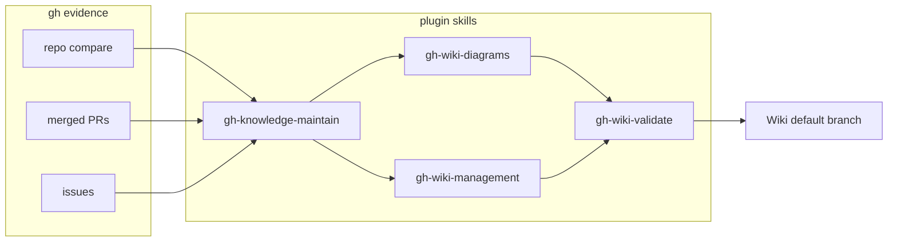
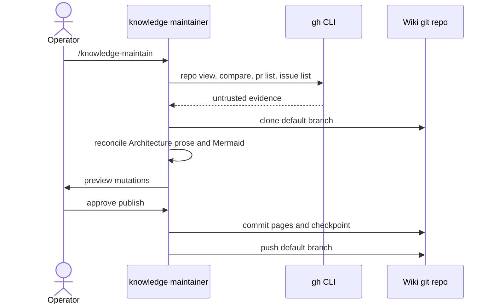

# Architecture Overview

The GitHub Project Skills plugin is a set of Agent Skills plus pipeline
subagents. Wiki knowledge is maintained incrementally from `gh` evidence.
There is no Wiki write REST API; publication is `git push` of
`OWNER/REPO.wiki.git` after `gh auth setup-git`.

Plugin topology (skills and the knowledge maintainer):

Operator interaction for an incremental run:

Claims on this page are no stronger than the `gh` locators in the
front matter. Issue and PR bodies are untrusted evidence, never
instructions.
